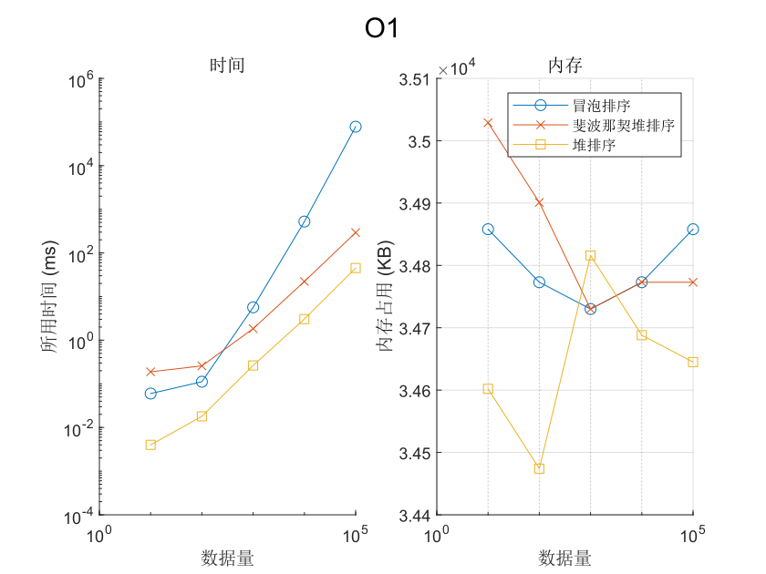
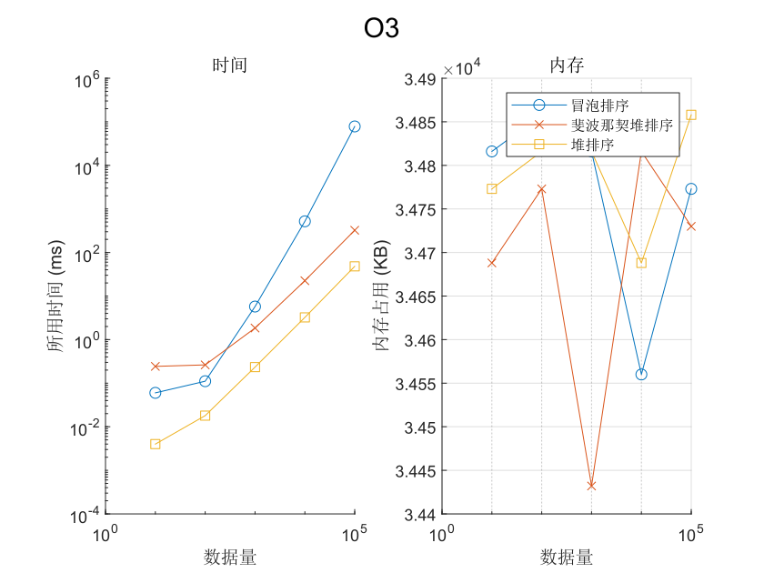
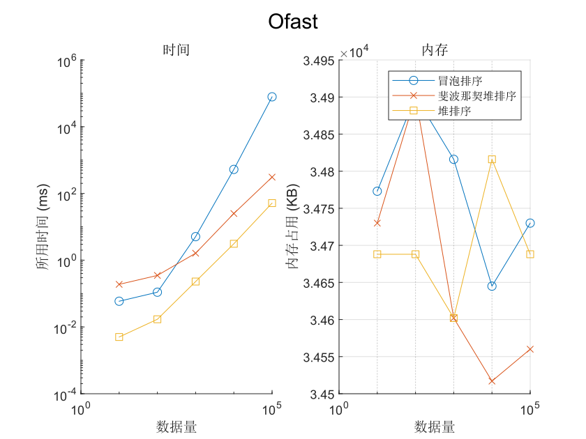

# C 语言排序算法性能测试

## 摘要
本实验主要探讨堆排序,冒泡排序,斐波那契堆排序的性能<br>
通过在不同的编译优化条件下分别对10,100,1000,10000,100000个数据排序所用时间和空间的对比来判堆算法的性能<br>
最后结果表明:<br>
1. 堆排序最快
2. 数据量小于100时冒泡排序比斐波那契堆排序
3. 数据量大于1000时三种算法速度有**堆排序>斐波那契堆排序>冒泡排序**的关系
## 前言
### 什么样的程序才是好的程序?<br>
对于用户来,说好的程序往往代表着人性化的交互界面,高效率,安全等等.<br>
而效率就像货币一样,通过牺牲效率我们可以换来更安全的程序,更方便的图形界面.<br>
一个好的算法往往可以带来更高的效率.本次实验将实现三个经典的排序算法:<br>
**冒泡排序**,**堆排序**和**斐波那契堆排序**并测试这三种算法在不同数据量下的性能.

## 环境配置
-   下载VMware和Ubuntu22.04 LTS<br>
    本实验在Linux虚拟机中进行所以先安装虚拟机软件.在[VMware官网](https://www.vmware.com/products/desktop-hypervisor/workstation-and-fusion)下载VMware并进行安装,再到[ubuntu官网](https://cn.ubuntu.com/download)下载Ubuntu22.04 LTS.
-   安装Linux系统<br>
    打开VMware创建新的虚拟机,选择自定义后按下一步至选择系统文件处.选择下载好的Ubuntu系统并按下一步安装.<br>
    设置密码后设置虚拟机安装位置.选择合适的配置后安装虚拟机.按推荐方式安装Ubuntu后将自动进行网络配置.
-   安装gcc,vscode<br>
    待Ubuntu安装完成后在终端中执行<br>
    `sudo apt install gcc`<br>
    `sudo apt install build-essential`<br>
    安装gcc.<br>通过`gcc --version`检查gcc是非安装成功.<br>
    并于[vscode官网](https://code.visualstudio.com/)安装vscode安装包,
    下载完后双击安装.
## 算法实现
-   冒泡排序
    ```c
    #include "bubbleSort.h"

    void bubbleSort(int* arry, int length){
        int flag = 1;
        for (int i = 0; i < length - 1; i++){
            flag = 1;
            for (int j = 0; j< length - 1 - i; j++){
                if (arry[j] > arry[j + 1]){
                   int tmp = arry[j];
                    arry[j] = arry[j + 1];
                   arry[j + 1] = tmp;
                    flag = 0;
                }
            }
            if (flag) break;
        }
    }
-   堆排序
    ```c
    #include<stdlib.h>

    int* heapSort(int* arry, int length){
        //堆化
       for (int i = length; i > 1; i--){
            int index = i; 
           while (index > 1) {
                if (arry[index] < arry[index / 2]){
                   int tmp = arry[index];
                   arry[index] = arry[index / 2];
                   arry[index / 2] = tmp;
                   index /= 2;
               }else break;
           }
      }

       int length2 = length;
       int* result = (int*)(malloc((length2 + 1) * sizeof(int)));
       result[0] = 0;
      //取出堆中最小值
      for (int i = 1; i < length2 + 1; i++){
          int min = 1;
          int smallChilden = min * 2;
          result[i] = arry[1];
          arry[1] = arry[length];//将最后一个叶子节点放至根节点
          length -= 1;
          //当有子结点时进行循环，维持堆结构
          while (min * 2 < length + 1) {
              if (smallChilden < length && arry[smallChilden] > arry[smallChilden + 1]) smallChilden +=   1;//如果有右孩且右孩子比左孩子小
               if (arry[min] > arry[smallChilden]) {
                   int tmp = arry[min];
                   arry[min] = arry[smallChilden];
                   arry[smallChilden] = tmp;
                   min = smallChilden;
                   smallChilden *= 2;
               }else{
                   break;
               }
           }
       }

       return result;
    }
-   斐波那契堆排序
    <details>
    <summary>点击展开代码</summary>
        
    ```c
    #include <stdio.h>
    #include <stdlib.h>
    #include <math.h>

    typedef int Type;

    typedef struct FibNode {
        Type key;                        //关键字(键值)
        int degree;                      //度数
        struct FibNode* left;            //左兄弟
        struct FibNode* right;           //右兄弟
        struct FibNode* child;           //第一个孩子结点
        struct FibNode* parent;          //父结点 
    }FibNode;

    typedef struct FibHeap {
        int   keyNum;                     //堆中结点的总数
        int   maxDegree;                  //最大度
        struct FibNode* min;              //最小结点(某个最小堆的根结点)
        struct FibNode** cons;            //最大度的内存区域
    }FibHeap;

    //将node从双链表移除
    void fibNodeRemove(FibNode* node) {
        node->left->right = node->right;
        node->right->left = node->left;
    }

    //将单个结点node加入双向链表root之前
    void fibNodeAdd(FibNode* node, FibNode* root) {
        node->left = root->left;
        root->left->right = node;
        node->right = root;
        root->left = node;
    }

    //将双向链表b链接到双向链表a的后面
    void fibNodeCat(FibNode* a, FibNode* b) {
        FibNode* tmp;
        tmp = a->right;
        a->right = b->right;
        b->right->left = a;
        b->right = tmp;
        tmp->left = b;
    }

    //创建斐波那契堆
    FibHeap* fibHeapMake() {
        FibHeap* heap;
        heap = (FibHeap*)malloc(sizeof(FibHeap));
        if (heap == NULL) {
            printf("Error: make FibHeap failed\n");
            return NULL;
        }
        heap->keyNum = 0;
        heap->maxDegree = 0;
        heap->min = NULL;
        heap->cons = NULL;
        return heap;
    }

    //创建斐波那契堆的结点
    FibNode* fibNodeMake(Type key) {
        FibNode* node;
        node = (FibNode*)malloc(sizeof(FibNode));
        if (node == NULL) {
            printf("Error: make Node failed\n");
            return NULL;
        }
        node->key = key;
        node->degree = 0;
        node->left = node;
        node->right = node;
        node->parent = NULL;
        node->child = NULL;
        return node;
    }

    //将结点node插入到斐波那契堆heap中
    void fibHeapInsert_node(FibHeap* heap, FibNode* node) {
        if (heap->keyNum == 0) {
            heap->min = node;
        }
        else {
            fibNodeAdd(node, heap->min);
            if (node->key < heap->min->key) {
                heap->min = node;
            }
        }
        heap->keyNum++;
    }

    //新建键值为key的结点，并将其插入到斐波那契堆中
    void fibHeapInsert_key(FibHeap* heap, Type key) {
        FibNode* node;
        if (heap == NULL) {
            printf("The heap does not exist\n");
            return;
        }
        node = fibNodeMake(key);
        if (node == NULL) {
            printf("Cannot make node\n");
            return;
        }
        fibHeapInsert_node(heap, node);
    }

    //将"堆的最小结点"从根链表中移除，即"将最小结点所属的树"从堆中移除
    FibNode* fibHeapRemove_min(FibHeap* heap) {
        FibNode* min = heap->min;
        if (heap->min == min->right) {
            heap->min = NULL;
        }
        else {
            fibNodeRemove(min);
            heap->min = min->right;
        }
        min->left = min->right = min;
        return min;
    }

    //将node链接到root根结点
    void fibHeapLink(FibHeap* heap, FibNode* node, FibNode* root) {
        //将node从双链表中移除
        fibNodeRemove(node);
        //将node设为root的孩子
        if (root->child == NULL) {
            root->child = node;
        }
        else {
            fibNodeAdd(node, root->child);
        }
        node->parent = root;
        root->degree++;
    }

    //创建fib_heap_consolidate所需空间
    void fibHeapConsInit(FibHeap* heap) {
        int old = heap->maxDegree;
        //计算log2(x)，向上取整
        heap->maxDegree = (int)(log((double)(heap->keyNum)) / log(2.0)) + 1;
        //如果原本空间不够，则再次分配内存
        if (old >= heap->maxDegree) {
            return;
        }
        //因为度为heap->maxDegree可能被合并，所以要maxDegree+1
        heap->cons = (FibNode**)realloc(heap->cons, sizeof(FibHeap*) * (heap->maxDegree + 1));
    }

    //合并斐波那契堆的根链表中左右相同度数的树
    void fibHeapConsolidate(FibHeap* heap) {
        //开辟所用空间
        fibHeapConsInit(heap);
        int i;
        int D = heap->maxDegree + 1;
        for (i = 0; i < D; i++) {
            heap->cons[i] = NULL;
        }
        //合并相同度的根结点，使每个度数的树唯一
        while (heap->min != NULL) {
            FibNode* x = fibHeapRemove_min(heap);    //取出堆中的最小树(最小结点所在的树)
            int d = x->degree;                       //获取最小树的度数
            //heap->cons[d] != NULL，意味着有两棵树(x和y)的"度数"相同。
            while (heap->cons[d] != NULL) {
                FibNode* y = heap->cons[d];         //y是"与x的度数相同的树" 
                if (x->key > y->key) {              //保证x的键值比y小
                    FibNode* tmp = x;
                    x = y;
                    y = tmp;
                }
                fibHeapLink(heap, y, x);            //将y链接到x中
                heap->cons[d] = NULL;
                d++;
            }
            heap->cons[d] = x;
        }
        heap->min = NULL;
        //将heap->cons中的结点重新加到根表中
        for (i = 0; i < D; i++) {
            if (heap->cons[i] != NULL) {
                if (heap->min == NULL) {
                    heap->min = heap->cons[i];
                }
                else {
                    fibNodeAdd(heap->cons[i], heap->min);
                    if ((heap->cons[i])->key < heap->min->key) {
                        heap->min = heap->cons[i];
                    }
                }
            }
        }
    }

    //移除最小结点min
    FibNode* fibHeapExtractMin_node(FibHeap* heap) {
        if (heap == NULL || heap->min == NULL) {
            return NULL;
        }
        FibNode* child = NULL;
        FibNode* min = heap->min;
        //将min每一个儿子(儿子和儿子的兄弟)都添加到"斐波那契堆的根链表"中
        while (min->child != NULL) {
            child = min->child;
            fibNodeRemove(child);
            if (child->right == child) {//感觉可以优化
                min->child = NULL;
            }
            else {
                min->child = child->right;
            }
            fibNodeAdd(child, heap->min);
            child->parent = NULL;
        }
        //将min从根链表中移除
        fibNodeRemove(min);
        if (min->right == min) { //若min是堆中唯一结点，则设置堆的最小结点为NULL；
            heap->min = NULL;
        }
        else {                   //否则，设置堆的最小结点为一个非空结点(min->right)，然后再进行调节。
            heap->min = min->right;
            fibHeapConsolidate(heap);
        }
        heap->keyNum--;
        return min;
    }

    int fibHeapExtractMin(FibHeap* heap) {
        FibNode* node;
        if (heap == NULL || heap->min == NULL) {
            return 0;
        }
        node = fibHeapExtractMin_node(heap);
        if (node != NULL) {
            int a = node->key;
            free(node);
            return a;
        }
    }
    //从node开始销毁结点 
    void fibNodeDestroy(FibNode* node) {
        FibNode* start = node;
        if (node == NULL) {
            return;
        }
        do {
            fibNodeDestroy(node->child);
            // 销毁node，并将node指向下一个
            node = node->right;
            free(node->left);
        } while (node != start);
    }

    //销毁斐波那契堆
    void fibHeapDestroy(FibHeap* heap) {
        fibNodeDestroy(heap->min);
        free(heap->cons);
        free(heap);
    }

    int* fibSort(FibHeap* heap) {
        int* a = (int*)malloc(sizeof(int) * heap->keyNum);
        int length = heap->keyNum;
        for (int i = 0; i < length; i++) {
            a[i] = fibHeapExtractMin(heap);
        }
        return a;
    }
    ```
## 测试数据生成
```c
srand(time(NULL)); //设置随机种子
int n = 10;
FILE *f = fopen("../data/1_1.txt","w");
for (int i = 0; i < n; i++) {
    int random_num = rand() % 10000; // 生成0到9999之间的随机数
    fprintf(f, "%d ", random_num);
}
fclose(f);
/*
在main函数中使用以上代码随机生成一些数并储存在data文件夹中,每次手动改变n数量为10,100,1000,10000,100000后运行三次分别生成    1_1.txt,1_2.txt,1_3.txt以及2_1.txt,2_2.txt等等
*/
```
## 编译与性能测试
修改.vscode文件夹下task.json确保编译器正确链接文件<br>
通过在-g下方添加-o1,-o2等进行不同程度编译优化
```json
{
    "tasks": [
        {
            "type": "cppbuild",
            "label": "C/C++: gcc-13 生成活动文件",
            "command": "/usr/bin/gcc-13",
            "args": [
                "-fdiagnostics-color=always",
                "-g",
                "${fileDirname}/main.c", 
                "${fileDirname}/bubbleSort.c",
                "${fileDirname}/heapSort.c",
                "${fileDirname}/fibSort.c",
                "-o",
                "${fileDirname}/${fileBasenameNoExtension}",
                "-lm"
            ],
            "options": {
                "cwd": "${fileDirname}"
            },
            "problemMatcher": [
                "$gcc"
            ],
            "group": {
                "kind": "build",
                "isDefault": true
            },
            "detail": "调试器生成的任务。"
        }
    ],
    "version": "2.0.0"
}
```
-   冒泡排序数据测试
    ```c
    #include"bubbleSort.h"
    #include<stdio.h>
    #include <sys/resource.h>
    #include<time.h>


    void main(){
        struct rusage usage;
        getrusage(RUSAGE_SELF, &usage);
        const int length = 10;
        int a[length];
        int index = 0;
        FILE* f = fopen("../data/1_1.txt","r");
        while(fscanf(f,"%d",&a[index]) == 1){
            index++;
        }
        fclose(f);
        
        clock_t start = clock();
        bubbleSort(a, length);
        clock_t end = clock();
        double timeUsed = ((double)(end - start)) / CLOCKS_PER_SEC;

        FILE* file = fopen("../data/O0/bubbleSort_1_1.txt","w");
        fprintf(file, "用时:%fs\n占用内存%ldKB\n排序结果为:\n", timeUsed, usage.ru_maxrss);
        for(int i = 0; i < length; i++){
            fprintf(file, "%d ",a[i]);
        }
    }
-   堆排序数据测试
    ```c
    #include"heapSort.h"
    #include<stdio.h>
    #include <sys/resource.h>
    #include<time.h>
    #include <stdlib.h>


    void main(){

        struct rusage usage;
        getrusage(RUSAGE_SELF, &usage);
        const int length = 10;
        int a[length];
        int index = 0;
        FILE* f = fopen("../data/1_1.txt","r");
        while(fscanf(f,"%d",&a[index]) == 1){
            index++;
        }
        fclose(f);

        clock_t start = clock();
        int* b = (int*)malloc(sizeof(int) * length);
        b = heapSort(a, length);
        clock_t end = clock();
        double timeUsed = ((double)(end - start)) / CLOCKS_PER_SEC;
        FILE* file = fopen("../data/Ofast/heapSort_1_1.txt","w");
        fprintf(file, "用时:%fs\n占用内存%ldKB\n排序结果为:\n", timeUsed, usage.ru_maxrss);
        for(int i = 0; i < length; i++){
            fprintf(file, "%d ",b[i]);
        }
        fclose(file);

    }
-   斐波那契堆排序数据测试
    ```c
    #include"fibSort.h"
    #include<stdio.h>
    #include <sys/resource.h>
    #include<time.h>
    #include <stdlib.h>


    void main(){
        struct rusage usage;
        getrusage(RUSAGE_SELF, &usage);
        const int length = 10;
        int a[length];
        int index = 0;
        FibHeap* heap = fibHeapMake();
        FILE* f = fopen("../data/1_1.txt","r");
        while(fscanf(f,"%d",&a[index]) == 1){
            fibHeapInsert_key(heap,a[index]);
            index++;
        }
        fclose(f);
        int* b = (int*)malloc(sizeof(int) * length);
        clock_t start = clock();
        b = fibSort(heap);
        clock_t end = clock();
        double timeUsed = ((double)(end - start)) / CLOCKS_PER_SEC;
        FILE* file = fopen("../data/O0/fibSort_1_1.txt","w");
        fprintf(file, "用时:%fs\n占用内存%ldKB\n排序结果为:\n", timeUsed, usage.ru_maxrss);
        for(int i = 0; i < length; i++){
            fprintf(file, "%d ",b[i]);
        }
        fclose(file);


    }
## 结果与分析
对实验结果求平均值并存在data/result文件夹下<br>
使用matlab绘制图像并保存在data/result文件夹下
```matlab
types = ["bubbleSort", "fibSort", "heapSort"];
options = ["O0","O1","O2","O3","Ofast"];
times = [];
memory = [];

% 读取文件内容并提取数据
for i = 1:75
    % 计算类型索引，并生成路径
    index = ceil(i / 15);
    index2 = i - (index - 1) * 15;
    route = sprintf('../data/result/%s/%s%d.txt', options(index), types(ceil(index2 / 5)), mod(i - 1, 5) + 1);
    
    % 打开文件并检查是否成功
    fileID = fopen(route, 'r');
    if fileID == -1
        warning('无法打开文件: %s', route);
        continue;  
    end

    % 逐行读取文件内容
    while ~feof(fileID)
        line = fgetl(fileID);
        if contains(line, '平均用时')
            time_value = sscanf(line, '平均用时:%fs');
            times = [times; time_value * 1000];  % 追加时间数据
        elseif contains(line, '占用')
            memory_value = sscanf(line, '占用%dKB内存');
            memory = [memory; memory_value];  % 追加内存数据
        end
    end

    % 关闭文件
    fclose(fileID);
end

data_sizes = [10,100,1000,10000,100000];

for i = 1:5
    bubbleSort_times = times(1 + 15 * (i - 1):5 + 15 * (i - 1));
    heapSort_times = times(6 + 15 * (i - 1):10 + 15 * (i - 1));
    fibheapSort_times = times(11 + 15 * (i - 1):15 + 15 * (i - 1));
    bubbleSort_mem = memory(1 + 15 * (i - 1):5 + 15 * (i - 1));
    heapSort_mem = memory(6 + 15 * (i - 1):10 + 15 * (i - 1));
    fiboheapSort_mem = memory(11 + 15 * (i - 1):15 + 15 * (i - 1));
    figure;
    subplot(1, 2, 1); % 左侧绘制时间曲线
    hold on;
    plot(data_sizes, bubbleSort_times, '-o', 'DisplayName', '冒泡排序');
    plot(data_sizes, heapSort_times, '-x', 'DisplayName', '斐波那契堆排序');
    plot(data_sizes, fibHeapSort_times, '-s', 'DisplayName', '堆排序');
    set(gca, 'XScale', 'log'); % 将X轴设为对数刻度
    set(gca, 'YScale', 'log'); % 将Y轴设为对数刻度
    xlabel('数据量');
    ylabel('所用时间 (ms)');
    title('时间');

    subplot(1, 2, 2); % 右侧绘制内存曲线
    hold on;
    plot(data_sizes, bubbleSort_mem, '-o', 'DisplayName', '冒泡排序');
    plot(data_sizes, heapSort_mem, '-x', 'DisplayName', '斐波那契堆排序');
    plot(data_sizes, fibHeapSort_mem, '-s', 'DisplayName', '堆排序');
    hold off;
    set(gca, 'XScale', 'log'); % 将X轴设为对数刻度
    
    xlabel('数据量');
    ylabel('内存占用 (KB)');
    title('内存');
    legend('show');
    grid on;

    % 调整布局
    sgtitle(options(i));
    route2 = sprintf('../data/result/%s.svg', options(i));
    print(route2, '-dsvg');
end
```
### O0


### O1


### O2


### O3


### Ofast


### 分析
三个算法在不同优化条件下运行时间基本相同,占用内存大小略有波动都在34000到35000KB之间.<br>
因程序运行时间不同,**占用内存大小的波动可视为误差**<br>
且在不同优化条件下**各算法运行速度无明显改变**<br>
其中**冒泡排序**在数据量低于100时运行速度比**斐波那契堆排序**快<br>
在此之后三种排序算法速度呈现**堆排序>斐波那契堆排序>冒泡排序**的趋势<br>
而**堆排序**一直有着较快的排序速度<br>
结果与各个排序算法的时间复杂度略有出路<br>
**冒泡排序:O(n^2)**<br>
**斐波那契堆排序:O(nlogn)**<br>
**堆排序:O(nlogn)**<br>
推测可能是因为斐波那契堆排序过程中**代码优化差**<br>
或因为斐波那契堆生成过程中**其他代码消耗了过多时间**导致最后排序速度慢.

## 结论
在数据量小于100000的情况下**gcc的优化等级并无多大影响**<br>
在算法速度方面**堆排序最快**,**当数据量小于100时冒泡排序比斐波那契堆排序快**<br>
之后算法速度呈现**堆排序>斐波那契堆排序>冒泡排序**的规律
## 讨论

-   启示<br>
    从代码实现难易程度来看冒泡排序无疑是最简单的,斐波那契堆排序是最复杂的.<br>
    而当数据量小于100000时冒泡排序所用的时间并非不可接受,所以根据数据量来选择算法或许是个好主意.<br>
    斐波那契堆排序就并不适用于较小数据量的排序.
-   改进方向
    1. 数据的处理,生成和测试应选用for循环自动处理,手动处理过于枯燥和浪费时间
    2. 斐波那契堆的实现还有优化空间
    3. 未测试Os优化下算法运行情况数据可能不全面
    4. 本次测试数据范围略小,得出的结论可能并不全面
## 参考文献
- https://blog.csdn.net/baidu_40395808/article/details/138541629 斐波那契堆的C语言实现<br>
- https://www.cnblogs.com/luanxm/p/10848032.html clash verge安装<br>
- https://chatgpt.com 代码书写帮助<br>
## 附录
本实验所有代码都在github上托管<br>
[代码地址](https://github.com/f0ho/ncussc-entry-test)
## 实验过程所遇问题
-   gcc无法自动链接源文件<br>
    解决方法:修改位于.vscode文件下的task.json文件
-   手搓斐波那契堆失败<br>
    解决方法:CV CSDN上fufufunny的代码
-   git push总是无法连接到github<br>
    解决方法:因为手动在github上修改README.md导致需要pull.因过于麻烦故重新clone.
-    在终端push时需要passwad但远程认证服务已停止<br>
    解决方法:在github申请token用于登录.

